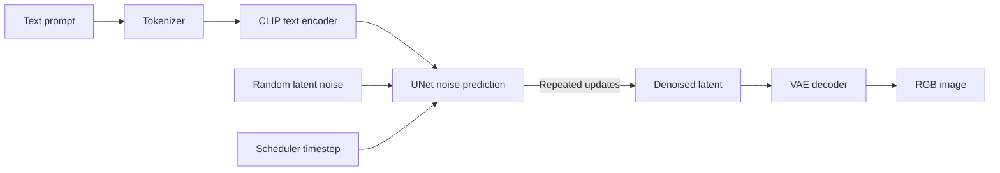
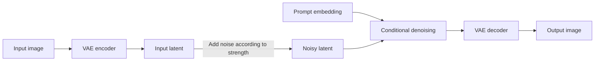

# Diffusion Models: From Noise to Images

This chapter explains diffusion image generation from first principles and then connects each idea to this repository. The aim is not merely to run a command. It is to understand what the command asks the model to do, why each parameter matters, and how to diagnose a bad result.

## 1. The central idea

A diffusion model learns to reverse a gradual corruption process.

Imagine taking a clear image and repeatedly adding a small amount of Gaussian noise. After enough steps, the original structure disappears and only random noise remains. This is the **forward diffusion process**.

Generation runs the learned process in reverse. It starts from random noise and repeatedly predicts what noise should be removed. Text conditioning steers that denoising toward a requested subject.


The network is not searching a database for a stored picture. It has learned statistical relationships among visual structures, noise levels, and text descriptions.

## 2. Forward diffusion

Let $x_0$ be a clean training sample. At timestep $t$, noise is added according to a schedule:

$$
q(x_t \mid x_{t-1}) = \mathcal{N}\left(x_t; \sqrt{1-\beta_t}\,x_{t-1}, \beta_t I\right)
$$

Here:

- $\beta_t$ controls how much noise is added at step $t$.
- $I$ is the identity covariance matrix.
- $\mathcal{N}$ denotes a Gaussian distribution.

Using cumulative notation, a noisy sample can be produced directly from $x_0$:

$$
x_t = \sqrt{\bar{\alpha}_t}\,x_0 + \sqrt{1-\bar{\alpha}_t}\,\epsilon,
\qquad \epsilon \sim \mathcal{N}(0,I)
$$

where $\alpha_t = 1-\beta_t$ and $\bar{\alpha}_t = \prod_{s=1}^{t}\alpha_s$.

This equation is fundamental. A noisy sample is a weighted combination of the original sample and random noise. As $t$ grows, the original contribution shrinks.

## 3. What the neural network learns

During training, the model sees:

1. A clean sample $x_0$.
2. A randomly selected timestep $t$.
3. Random noise $\epsilon$.
4. The resulting noisy sample $x_t$.
5. Optional conditioning, such as a text embedding.

A common objective trains a neural network $\epsilon_\theta$ to predict the noise that was added:

$$
\mathcal{L} = \mathbb{E}_{x_0,t,\epsilon}
\left[
\left\|\epsilon - \epsilon_\theta(x_t,t,c)\right\|_2^2
\right]
$$

The conditioning value $c$ is the encoded prompt. Once the model can estimate noise at many noise levels, a numerical solver can use those estimates to travel from noise toward a clean sample.

The model therefore does not usually predict a finished image in one operation. It predicts information needed for one denoising update, and the scheduler repeats that update.

## 4. Why Stable Diffusion works in latent space

Applying diffusion directly to a $512 \times 512 \times 3$ image is expensive. Stable Diffusion instead operates in a compressed **latent space**.

A variational autoencoder, or VAE, supplies two transformations:

$$
z = \operatorname{Encoder}(x)
$$

$$
\hat{x} = \operatorname{Decoder}(z)
$$

For a typical Stable Diffusion 1.5 pipeline, a $512 \times 512$ RGB image corresponds roughly to a $4 \times 64 \times 64$ latent tensor. Denoising that smaller tensor requires far less memory and computation.



The major components are:

- **Tokenizer:** converts text into token IDs.
- **Text encoder:** converts tokens into semantic vectors.
- **UNet:** predicts noise or an equivalent denoising quantity.
- **Scheduler:** decides timesteps and computes latent updates.
- **VAE:** decodes the final latent into pixels.

A pipeline is the orchestration of these components. A model checkpoint alone is not the complete runtime behavior.

## 5. Text conditioning

The prompt is tokenized and passed through a text encoder, commonly CLIP for Stable Diffusion 1.x. The resulting embeddings enter the UNet through cross-attention layers.

Cross-attention allows spatial features in the latent to attend to prompt tokens. Roughly speaking, latent features ask which textual concepts are relevant while the image structure develops.

A prompt such as:

```text
red ceramic teapot on a wooden table, soft window light
```

provides several kinds of conditioning:

- Subject: `teapot`
- Material and color: `red ceramic`
- Setting: `wooden table`
- Lighting: `soft window light`

Longer prompts are not automatically better. Repetition and conflicting instructions can compete for limited token and attention capacity.

### Repository prompt policy

The function `apply_image_prompt_defaults` in `compute.py` prepends a photorealistic system prompt and supplies a shared negative prompt. Therefore, the model receives more text than the literal value passed to `--prompt`.

Use the defaults:

```powershell
make example PROMPT="portrait beside a rain-covered window"
```

Disable the system prefix when testing the raw model response:

```powershell
.venv-win\Scripts\python.exe example.py `
  --prompt "watercolor landscape" `
  --no-system-prompt `
  --output watercolor.png
```

A photorealistic prefix conflicts with a watercolor request, so disabling it in that example is meaningful rather than cosmetic.

## 6. Negative prompts

Classifier-free guidance can compare two predictions:

- A conditional prediction associated with the requested prompt.
- An unconditional or negative-conditioned prediction.

A simplified guided prediction is:

$$
\epsilon_{\text{guided}} =
\epsilon_{\text{negative}} +
w\left(\epsilon_{\text{prompt}}-\epsilon_{\text{negative}}\right)
$$

The value $w$ is the **guidance scale**, exposed as `--cfg` in this repository.

A negative prompt is not a guaranteed prohibition mechanism. It changes the direction of guidance in embedding space. It is best understood as a preference signal.

Example:

```powershell
.venv-win\Scripts\python.exe example.py `
  --prompt "macro photograph of a mechanical watch" `
  --negative "text, watermark, duplicate watch" `
  --cfg 5 `
  --output watch.png
```

The supplied negative text is appended to the repository's shared negative prompt.

## 7. Classifier-free guidance

CFG controls how aggressively generation follows the difference between positive and negative conditioning.

- Low CFG allows more freedom but may ignore details.
- Moderate CFG often balances composition and prompt adherence.
- High CFG can oversaturate colors, create harsh edges, reduce realism, or amplify defects.

This repository's default model card recommends a value near `5`. A value such as `7.5` is common for Stable Diffusion generally, but model-specific guidance should take precedence over folklore.

Compare with a fixed seed:

```powershell
.venv-win\Scripts\python.exe example.py --prompt "studio photo of a green mug" --seed 42 --cfg 3 --output cfg-3.png
.venv-win\Scripts\python.exe example.py --prompt "studio photo of a green mug" --seed 42 --cfg 5 --output cfg-5.png
.venv-win\Scripts\python.exe example.py --prompt "studio photo of a green mug" --seed 42 --cfg 12 --output cfg-12.png
```

Keep every other parameter fixed. Otherwise, the comparison teaches nothing because a different initial noise sample can dominate the visible difference.

## 8. Seeds and reproducibility

Generation begins from pseudo-random latent noise. A seed selects that initial noise.

In this repository:

- A nonzero `--seed` calls `torch.manual_seed`.
- Seed `0` means no explicit seeding and therefore does not mean a reproducible all-zero seed.
- `test_scripts.sh` uses a fixed nonzero seed so regressions can be compared consistently.

A seed does not uniquely define an image across all environments. Output may also depend on:

- Model revision and weights
- Scheduler and scheduler configuration
- Number of steps
- Prompt and negative prompt
- CFG
- Image dimensions
- Library versions
- Numeric dtype
- Device backend and kernel implementation

For a useful experiment, record all of these values.

## 9. Schedulers are numerical solvers

The trained UNet supplies denoising estimates. The scheduler decides where to evaluate those estimates and how to update the latent.

This distinction is crucial:

- The **noise schedule used in training** defines corruption levels.
- The **inference scheduler or sampler** numerically solves the reverse trajectory using a limited number of model evaluations.

Different schedulers can produce materially different images from the same weights and seed. They differ in stability, speed, timestep spacing, and assumptions about the differential equation being solved.

### PNDM versus DPM++ in this repository

The model repository declares `PNDMScheduler`, but our deterministic investigation showed severe structured distortion with that bundled scheduler. Changing prompt, device, dtype, steps, and CFG did not remove the artifacts.

Changing only the scheduler to DPM++ with Karras sigmas produced a clean image:

```python
pipe.scheduler = DPMSolverMultistepScheduler.from_config(
    pipe.scheduler.config,
    algorithm_type="dpmsolver++",
    use_karras_sigmas=True,
)
```

This is now used by the PyTorch text-to-image and image-to-image paths.

Karras sigmas redistribute solver evaluations across noise levels. DPM++ is a modern solver family designed for diffusion inference. Neither is universally superior for every model, but this combination is the verified profile for the model used here.

The general lesson is direct: **weights do not determine output quality by themselves**. Scheduler compatibility is part of the effective model configuration.

## 10. Inference steps

`--steps` is the number of scheduler updates. More steps provide more opportunities to refine the latent, but the relationship is not linear.

- Too few steps can leave unresolved structure.
- A suitable range produces stable detail.
- Excessive steps cost time and may yield little improvement.

The actual number of UNet evaluations can differ from the displayed step count for some solvers. In img2img, strength can also reduce the portion of the schedule that is traversed.

Example experiment:

```powershell
.venv-win\Scripts\python.exe example.py --prompt "old library interior" --seed 99 --steps 10 --output steps-10.png
.venv-win\Scripts\python.exe example.py --prompt "old library interior" --seed 99 --steps 20 --output steps-20.png
.venv-win\Scripts\python.exe example.py --prompt "old library interior" --seed 99 --steps 30 --output steps-30.png
```

Judge composition and defects, not merely sharpness.

## 11. Text-to-image generation

Text-to-image starts from random latent noise:

$$
z_T \sim \mathcal{N}(0,I)
$$

The scheduler repeatedly updates it:

$$
z_{t-1} = \operatorname{Step}\left(z_t,
\epsilon_\theta(z_t,t,c),t\right)
$$

After the final update, the VAE decodes $z_0$ into an image.

In `example.py`, the operational sequence is:

1. Select a device.
2. Select a runtime dtype.
3. construct positive and negative prompts.
4. Load the pretrained pipeline.
5. Replace PNDM with DPM++/Karras.
6. Move the pipeline to the selected device.
7. Denoise under `torch.no_grad()`.
8. Decode and save the image.

Basic command:

```powershell
make example PROMPT="product photograph of a brass desk lamp"
```

Direct invocation exposes all controls:

```powershell
.venv-win\Scripts\python.exe example.py `
  --prompt "product photograph of a brass desk lamp" `
  --output lamp.png `
  --steps 30 `
  --cfg 5 `
  --seed 12345 `
  --width 512 `
  --height 512
```

## 12. Image-to-image generation

Img2img does not begin from pure random noise. It encodes an input image into a latent, adds noise to a chosen level, and denoises from there under a new prompt.



A conceptual form is:

$$
z_t = \sqrt{\bar{\alpha}_t}z_0 +
\sqrt{1-\bar{\alpha}_t}\epsilon
$$

The `--strength` value chooses how far into the noisy trajectory generation begins.

- Low strength preserves more of the input.
- Medium strength changes style and local structure.
- High strength permits major recomposition and may lose identity or layout.

Example:

```powershell
.venv-win\Scripts\python.exe img2img.py `
  --input lamp.png `
  --output lamp-evening.png `
  --prompt "same brass desk lamp in warm evening light" `
  --strength 0.45 `
  --steps 30 `
  --cfg 5 `
  --seed 12345
```

The script currently resizes the input to a square using `Image.resize`. That can stretch a non-square source. A production workflow should crop or pad according to an explicit composition policy.

## 13. Model variant versus runtime dtype

These are related but distinct concepts.

### Weight variant

`--variant fp16` tells Diffusers which named files to load, such as `diffusion_pytorch_model.fp16.safetensors`. It identifies a repository artifact.

### Runtime dtype

`--dtype float16` or `--dtype float32` controls the tensor representation used during execution.

The repository uses `auto` as follows:

- GPU plus fp16 variant: execute in float16.
- CPU: execute in float32.

Thus it is valid to load weights stored in fp16 files and convert them to float32 for CPU execution. File naming does not force every operation to remain in fp16.

### Why precision matters

Float16 uses less memory and is often faster on supported GPUs, but it has less numeric range and precision. Some operations or backends can overflow, underflow, or use kernels with backend-specific limitations. Float32 is slower and larger but is often a useful diagnostic reference.

When investigating corruption, compare one variable at a time:

```text
same seed + same scheduler + same prompt + same steps + different dtype
```

Do not simultaneously change the model, scheduler, and device and then claim to know which one fixed the image.

## 14. Device backends

A device name describes where PyTorch or ONNX Runtime executes operations. It does not describe the model itself.

This repository recognizes these local GPU paths:

- **DirectML:** Windows GPU path, including supported AMD hardware.
- **ROCm:** AMD GPU stack on supported Linux environments.
- **CUDA:** NVIDIA GPU stack.
- **MIGraphX:** an AMD-oriented ONNX Runtime provider where available.
- **CPU:** deliberate fallback, much slower for diffusion.

`compute.py` refuses accidental CPU fallback unless explicitly allowed. This prevents a command that appears to use a GPU from silently taking many minutes on the CPU.

Check the environment:

```powershell
make gpu-info
make test-gpu
```

Force CPU deliberately:

```powershell
.venv-win\Scripts\python.exe example.py `
  --prompt "simple wooden chair" `
  --device cpu `
  --allow-cpu `
  --output chair-cpu.png
```

### DirectML details

`torch-directml` exposes a PyTorch `privateuseone` device. Seeing `privateuseone:0` is therefore expected; it does not mean that an unknown CPU fallback was selected.

This repository disables DirectML tiled resources by default because that profile was found to be more reliable here. Attention slicing is also rejected for the default image model on DirectML unless explicitly overridden, because that combination was observed to hang.

These are compatibility decisions, not universal laws. Backend behavior depends on hardware, drivers, framework versions, and model architecture.

## 15. Attention slicing and memory

Attention layers can consume substantial memory. Attention slicing divides attention computation into smaller pieces.

The tradeoff is normally:

- Lower peak memory
- More sequential work
- Potentially slower inference

On this particular DirectML setup, attention slicing with the default model was observed to hang. `validate_torch_diffusion_profile` guards against that known-bad combination.

This illustrates an important engineering principle: an optimization is not an improvement unless it works correctly on the target backend.

## 16. PyTorch and ONNX Runtime

The repository supports two execution styles.

### PyTorch/Diffusers

PyTorch loads model components and executes them through a selected device backend. It is flexible and easy to modify, as demonstrated by replacing the scheduler in Python.

### ONNX Runtime

An exported ONNX pipeline executes graph representations through an execution provider such as DirectML or ROCm. It may offer deployment advantages, but it introduces another artifact boundary: the exported graph and pipeline directory must be compatible and complete.

Important distinctions:

- A provider being listed does not guarantee it represents the local GPU.
- `AzureExecutionProvider` is not the laptop GPU.
- `CPUExecutionProvider` is CPU execution.
- `DmlExecutionProvider` is the normal native Windows AMD path in this project.

Use `--ort_dir` with `text2img.py` or `img2img.py` to select ONNX mode. Without it, those scripts use PyTorch.

## 17. Safety checker components

Some Stable Diffusion pipelines include a post-generation safety checker. That checker is separate from the UNet denoising model and separate from negative prompting.

In this repository, image pipelines explicitly avoid loading or invoking that component:

```python
safety_checker=None
feature_extractor=None
requires_safety_checker=False
```

The ONNX paths also clear checker references before inference.

This changes post-processing behavior; it does not retrain the model, alter the diffusion equations, or guarantee that a prompt will produce a particular result. Application owners remain responsible for access controls, policy, legal compliance, and how generated media is used.

## 18. Resolution and memory cost

Stable Diffusion 1.5 is naturally associated with resolutions around $512 \times 512$. Larger dimensions increase latent size and attention cost.

If width and height are both doubled, pixel count becomes four times larger:

$$
(2W)(2H) = 4WH
$$

Memory and runtime may rise by more than that for some intermediate operations. Generating directly at $2048 \times 2048$ is therefore not merely a sharper version of a 512px run. It is a much harder and more expensive inference problem, and SD 1.5 may produce duplicated structures or weak global composition at such dimensions.

A common workflow is:

1. Generate near the model's native resolution.
2. Select a composition.
3. Upscale with a dedicated model.
4. Optionally refine using controlled img2img strength.

Always use dimensions divisible by the pipeline's spatial scale, normally at least 8 for Stable Diffusion.

## 19. Why outputs become distorted

Distortion is a symptom, not a diagnosis. Possible causes include:

- Incompatible scheduler configuration
- Excessive CFG
- Too few inference steps
- Unsupported or unstable precision
- Backend kernel defects
- Incorrect VAE or scaling factor
- Corrupt or mismatched model files
- Generating far outside the model's trained resolution distribution
- Conflicting prompt conditioning
- Img2img strength that destroys too much source structure

### The investigation performed in this repository

The distorted-output investigation used controlled experiments:

1. Confirm the selected backend and dtype from logs.
2. Inspect output pixel statistics to rule out simple all-black or NaN-like failure.
3. Compare CPU and DirectML behavior.
4. Compare float32 and float16 behavior.
5. Inspect cached weight files and pipeline configuration.
6. Fix the seed so runs became comparable.
7. Test model-card CFG and step recommendations.
8. Change only the scheduler.

The decisive experiment held the model, prompt, seed, device, dtype, and dimensions constant. PNDM produced severe artifacts; DPM++ with Karras sigmas produced a clean result. That is stronger evidence than merely observing that a later command happened to look better.

## 20. Testing image pipelines

A file-existence test proves only that a file was written. The original smoke test also measured mean absolute pixel difference:

$$
\operatorname{MAD}(A,B) =
\frac{1}{3WH}
\sum_{x=1}^{W}\sum_{y=1}^{H}\sum_{c=1}^{3}
\left|A_{xyc}-B_{xyc}\right|
$$

This establishes that img2img changed the input, but it does not establish image quality. A severely corrupted image can differ greatly and pass the assertion.

A stronger test strategy has layers:

1. **Execution:** command exits successfully.
2. **Artifact:** image exists, opens, and has expected dimensions.
3. **Numeric sanity:** pixels are not constant, empty, or dominated by invalid values.
4. **Determinism:** a fixed profile gives repeatable output within backend tolerances.
5. **Perceptual regression:** compare against an approved reference using a perceptual metric.
6. **Human review:** inspect composition and semantic correctness for model upgrades.

Run the current smoke chain with:

```powershell
make clean
make test
```

The test chains text-to-image output into img2img, fixes the seed, and verifies that the second image differs from the first.

## 21. A disciplined experiment template

When tuning or debugging, begin with a baseline:

```powershell
.venv-win\Scripts\python.exe example.py `
  --prompt "natural-light portrait near a window" `
  --output baseline.png `
  --seed 12345 `
  --steps 30 `
  --cfg 5 `
  --width 512 `
  --height 512
```

Then alter exactly one variable:

```powershell
.venv-win\Scripts\python.exe example.py `
  --prompt "natural-light portrait near a window" `
  --output cfg-7.png `
  --seed 12345 `
  --steps 30 `
  --cfg 7 `
  --width 512 `
  --height 512
```

Write down:

| Field | Baseline | Experiment |
|---|---:|---:|
| Model | EpiCRealism-Natural-Sin | same |
| Variant | fp16 | same |
| Scheduler | DPM++ Karras | same |
| Seed | 12345 | same |
| Steps | 30 | same |
| CFG | 5 | 7 |
| Size | 512x512 | same |
| Device | selected backend | same |

This method turns image generation from guesswork into an experiment.

## 22. Practical command reference

Install the native Windows DirectML environment:

```powershell
make setup-directml
```

Inspect compute providers:

```powershell
make gpu-info
```

Generate with the default PyTorch example:

```powershell
make example PROMPT="cinematic photograph of a railway platform at dawn"
```

Use the general text-to-image entry point:

```powershell
make text2img PROMPT="clean studio photograph of a fountain pen"
```

Run img2img directly:

```powershell
.venv-win\Scripts\python.exe img2img.py `
  --input output.png `
  --output transformed.png `
  --prompt "the same scene during blue hour" `
  --strength 0.5 `
  --steps 30 `
  --cfg 5 `
  --seed 12345
```

Check video imports and device selection without downloading the large model:

```powershell
make video-check
```

Remove generated artifacts:

```powershell
make clean
```

## 23. Reading the repository

Use this order when studying the code:

1. `compute.py`: shared defaults, prompt construction, dtype selection, and backend selection.
2. `example.py`: compact PyTorch text-to-image pipeline.
3. `text2img.py`: PyTorch and ONNX text-to-image modes.
4. `img2img.py`: PyTorch and ONNX image-to-image modes.
5. `test_scripts.sh`: deterministic end-to-end smoke chain.
6. `gpu_info.py`: provider and device diagnostics.
7. `video/example.py`: text-to-video pipeline and its distinct resource demands.

Do not treat any one file as the entire system. Output is controlled by the interaction among model assets, prompt policy, scheduler, numeric representation, backend, and test configuration.

## 24. Final mental model

When a diffusion command runs, think through this sequence:

1. **Prompt policy** constructs positive and negative text.
2. **Tokenizer and text encoder** turn text into conditioning vectors.
3. **Seed** determines initial random noise.
4. **UNet** estimates noise at each selected noise level.
5. **CFG** combines positive and negative-conditioned estimates.
6. **Scheduler** converts estimates into latent updates.
7. **VAE** decodes the final latent into pixels.
8. **Runtime backend and dtype** determine how those computations execute.
9. **Post-processing components** may inspect or transform output.
10. **Tests** check only what they explicitly measure.

Most debugging mistakes come from collapsing these layers into the vague statement that "the model is broken." A model checkpoint is only one part of the pipeline. Good diffusion engineering means isolating each layer, changing one variable at a time, and demanding evidence that can distinguish one explanation from another.
