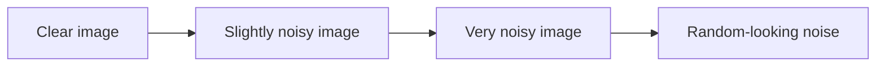
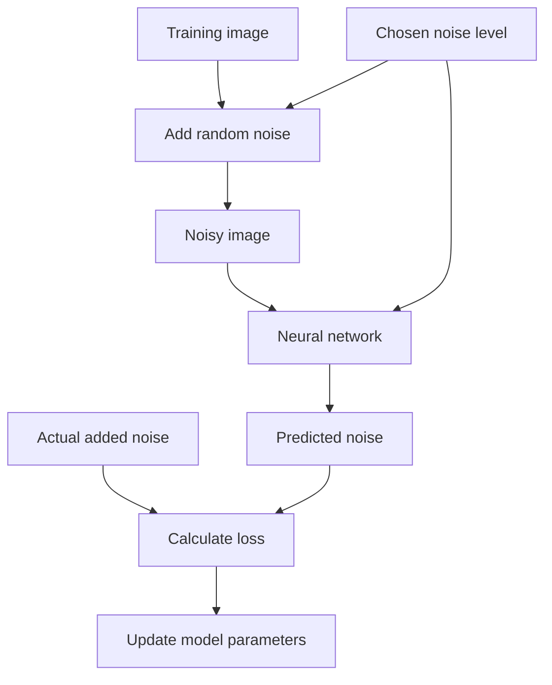
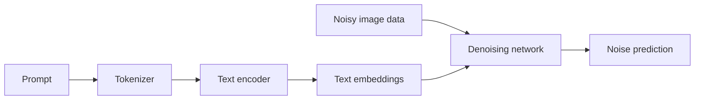
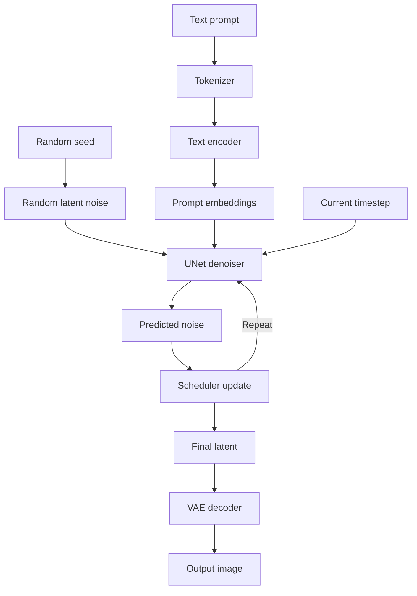

# Diffusion for a College Fresher

This chapter explains image diffusion models without assuming prior knowledge of machine learning. You should be comfortable with basic algebra and with the idea that a program stores numbers in variables and arrays. Everything else is introduced here.

The goal is to answer a simple question:

> How can a computer begin with random noise and gradually turn it into an image described by text?

We will build the answer one concept at a time.

## 1. Start with a digital image

A digital image is a rectangular grid of colored dots called **pixels**.

A small grayscale image might be represented by this table:

```text
  0   0  20  20
  0 180 220  20
 10 220 255  30
  0  10  20   0
```

Each number describes brightness:

- `0` means black.
- `255` means white.
- Values between them are shades of gray.

A color image normally stores three values per pixel:

```text
Red, Green, Blue
```

For example:

```text
(255, 0, 0)     bright red
(0, 255, 0)     bright green
(0, 0, 255)     bright blue
(255, 255, 255) white
(0, 0, 0)       black
```

Therefore, an image is data. It can be stored as a large collection of numbers.

A `512 x 512` RGB image contains:

$$
512 \times 512 \times 3 = 786{,}432
$$

color values. Image-generation software ultimately has to produce those values.

## 2. Arrays, vectors, matrices, and tensors

Machine-learning libraries use several words for organized collections of numbers.

### Scalar

A scalar is one number:

```text
7
```

### Vector

A vector is a one-dimensional list:

```text
[4, 8, 15, 16, 23, 42]
```

### Matrix

A matrix is a two-dimensional table:

```text
[1 2 3]
[4 5 6]
```

### Tensor

A tensor is the general term for a multidimensional collection of numbers.

Examples:

- A scalar is a zero-dimensional tensor.
- A vector is a one-dimensional tensor.
- A matrix is a two-dimensional tensor.
- A color image can be a three-dimensional tensor.
- A batch of images can be a four-dimensional tensor.

In PyTorch, image data is often arranged like this:

```text
batch x channels x height x width
```

A batch of one RGB image at `512 x 512` can therefore have shape:

```text
1 x 3 x 512 x 512
```

A tensor has both a **shape** and a **data type**. Shape says how values are arranged. Data type says how each number is represented, such as `float32` or `float16`.

## 3. What is noise?

Noise is random variation.

Imagine adding a small random value to every image pixel. The image becomes grainy. Add more random variation and the subject becomes harder to recognize. Continue long enough and the image becomes a field of random values.



Gaussian noise is commonly used. Its random values follow a bell-shaped probability distribution:

- Values near zero are common.
- Large positive values are uncommon.
- Large negative values are uncommon.

You do not need advanced statistics yet. The important point is that noise is random but follows known mathematical rules.

## 4. Probability in plain language

Probability describes uncertainty.

A normal program might calculate one exact answer:

```text
2 + 3 = 5
```

A generative model works with distributions of possible answers. Many different images can correctly match the phrase:

```text
a red bicycle beside a wall
```

The bicycle could face left or right. The wall could be brick or concrete. The lighting could come from any direction.

The model does not memorize one correct output. It represents patterns in a large space of plausible outputs.

A random seed selects a repeatable starting point within that process. The same seed and exactly the same pipeline settings usually reproduce the same initial noise.

## 5. What is machine learning?

Traditional programming gives the computer rules written by a programmer:

```text
if temperature > 30:
    print("hot")
```

Machine learning takes a different approach:

1. Choose a model containing adjustable numbers called **parameters**.
2. Show it many examples.
3. Measure how wrong its predictions are.
4. Adjust its parameters to reduce that error.
5. Repeat many times.

The adjustment process is called **training**.

Using a trained model to produce an answer is called **inference**.

This repository performs inference. It downloads trained weights and uses them to generate images. It does not train the Stable Diffusion model from scratch.

## 6. A neural network

A neural network is a large mathematical function containing many adjustable parameters.

At a very small scale, a unit might calculate:

$$
y = wx + b
$$

where:

- $x$ is an input.
- $w$ is a learned weight.
- $b$ is a learned bias.
- $y$ is an output.

Real neural networks combine millions or billions of such parameters with nonlinear operations. Layers learn different kinds of transformations.

For image models, early computations may respond to simple local patterns. Deeper computations can represent larger structures and relationships.

Do not interpret the word "neural" too literally. These systems are mathematical models inspired loosely by biological terminology, not simulations of a human brain.

## 7. Training, loss, and learning

A model needs a way to measure error. This measurement is called a **loss function**.

Suppose the correct value is $10$ and the model predicts $7$. A simple squared error is:

$$
(10 - 7)^2 = 9
$$

Training tries to reduce loss by changing model parameters. The usual mechanism involves:

- **Forward pass:** calculate a prediction.
- **Loss:** measure the error.
- **Backpropagation:** determine how each parameter contributed to the error.
- **Optimizer step:** adjust parameters slightly.

Repeat this process over many examples and the model gradually becomes better at its task.

For a diffusion model, the training task is usually related to predicting noise that was added to data.

## 8. The diffusion learning game

The central training game can be described without complicated mathematics:

1. Take a training image.
2. Choose a random noise level.
3. Add a known amount of random noise.
4. Ask the neural network to predict the added noise.
5. Compare its prediction with the actual noise.
6. Adjust the network to improve its future predictions.



After training across many images and noise levels, the network becomes useful at estimating how noisy data should be cleaned.

## 9. Generation reverses the process

At generation time, there is no starting photograph. The program creates a tensor of random noise.

Then it repeats this loop:

1. Give the current noisy tensor to the neural network.
2. Tell the network the current noise level.
3. Ask it to predict noise.
4. Use a scheduler to calculate a slightly cleaner tensor.
5. Continue until reaching a low-noise state.

Conceptually:

```text
random noise
    -> rough large shapes
    -> recognizable composition
    -> smaller structures
    -> final details
```

The process is iterative. The model normally does not produce the final image in one pass.

## 10. Why text can control the image

A text-to-image model needs a numerical representation of language.

The process begins with a **tokenizer**. It divides text into tokens and maps them to integer IDs.

For illustration only:

```text
"red bicycle"
    -> ["red", "bicycle"]
    -> [1847, 9210]
```

A **text encoder** converts those IDs into vectors called embeddings. Embeddings place related concepts into useful numerical relationships.

The image-denoising network then receives both:

- The noisy image representation
- The text embeddings

This allows the network to make denoising predictions that are relevant to the prompt.



## 11. Attention

Attention is a mechanism that helps a model decide which information is relevant to which other information.

In text-to-image generation, parts of the developing image can attend to parts of the prompt. The region forming a bicycle can draw information from the token representing `bicycle`; color-related features can draw information from `red`.

This is not a rigid one-word-to-one-region lookup. Attention values are learned, distributed, and can overlap.

Attention calculations can use a great deal of memory. Attention slicing performs the work in smaller pieces, often reducing peak memory at the cost of speed. Backend compatibility still matters: this repository avoids attention slicing for its default model on DirectML because that combination was observed to hang.

## 12. Why use a compressed latent space?

Working directly with every pixel is expensive. Stable Diffusion first represents images in a smaller space called **latent space**.

An autoencoder has two important parts:

- **Encoder:** compresses an image into a latent representation.
- **Decoder:** reconstructs an image from a latent representation.


Stable Diffusion performs the noise-removal process in this compressed space. After denoising, the decoder converts the latent into an RGB image.

This is why it is called a **latent diffusion model**.

A typical Stable Diffusion 1.5 image at `512 x 512` is represented during denoising by a latent with much smaller spatial dimensions, commonly `64 x 64` with four channels.

## 13. The major pipeline components

You can now understand the complete pipeline.



### Tokenizer

Converts prompt text into token IDs.

### Text encoder

Converts token IDs into semantic vectors.

### UNet

The main denoising neural network in Stable Diffusion 1.x. It predicts noise or a related quantity from the current latent, timestep, and prompt conditioning.

### Scheduler

Chooses noise levels and calculates how each prediction updates the latent.

### VAE

Decodes the final latent representation into pixels.

### Pipeline

Coordinates all the components and provides a convenient programming interface.

## 14. What is a model checkpoint?

Training produces learned parameters called **weights**. A checkpoint stores those weights, usually together with configuration files.

This repository uses this image model by default:

```text
imagepipeline/EpiCRealism-Natural-Sin
```

A Hugging Face model repository can contain separate files for:

- UNet weights
- Text encoder weights
- VAE weights
- Tokenizer files
- Scheduler configuration
- Pipeline configuration

Downloading a checkpoint does not mean downloading a complete application. Libraries such as PyTorch, Diffusers, and Transformers provide the code that executes those weights.

## 15. Prompts

A prompt describes the desired image.

Start with concrete nouns and observable properties:

```text
red ceramic teapot on a wooden table, soft window light
```

This is often clearer than a list of vague quality words.

Useful prompt categories include:

- Subject
- Environment
- Material
- Lighting
- Camera viewpoint
- Artistic medium
- Mood

Example:

```text
small sailboat on a lake, misty morning, viewed from the shore, watercolor
```

Avoid accidental contradictions:

```text
photorealistic watercolor 3D pencil photograph
```

A model may attempt to blend incompatible concepts, but the result becomes less predictable.

### This repository's system prompt

The project normally adds a photorealistic prefix to your prompt. That is useful for photography requests but can conflict with illustration or painting requests.

Use the default behavior:

```powershell
make example PROMPT="portrait near a window"
```

Disable the prefix for a non-photographic style:

```powershell
.venv-win\Scripts\python.exe example.py `
  --prompt "watercolor painting of a mountain village" `
  --no-system-prompt `
  --output village.png
```

## 16. Negative prompts

A negative prompt describes traits that should receive less emphasis.

Example:

```text
text, watermark, blurry, duplicate objects
```

It is not a logical `NOT` operator. It influences the generation direction but cannot guarantee that a concept never appears.

This repository supplies a shared negative prompt and appends text passed through `--negative`.

```powershell
.venv-win\Scripts\python.exe example.py `
  --prompt "product photo of a wristwatch" `
  --negative "text, watermark" `
  --output watch.png
```

## 17. Classifier-free guidance

The pipeline commonly makes two predictions during a step:

- A prediction associated with the requested prompt
- A prediction associated with empty or negative conditioning

It then emphasizes the difference. The strength of that emphasis is called **classifier-free guidance**, or CFG.

In this repository it is controlled with:

```text
--cfg 5
```

A simple mental model is:

- Low CFG: more freedom, weaker prompt adherence
- Medium CFG: balanced behavior
- High CFG: stronger pressure, with a risk of harsh colors and artifacts

Higher is not automatically better. The default model behaves well near CFG `5`.

## 18. Seeds

A seed initializes the pseudo-random number generator.

With a fixed environment and fixed settings, a seed lets you compare changes from the same starting noise.

```powershell
.venv-win\Scripts\python.exe example.py `
  --prompt "green mug on a desk" `
  --seed 42 `
  --cfg 5 `
  --output mug.png
```

In this repository, seed `0` means that no explicit seed is applied. Use a nonzero seed for experiments.

A seed alone is not enough for reproducibility. You must also keep the model, scheduler, prompt, image size, steps, CFG, software versions, dtype, and backend fixed.

## 19. Schedulers

The UNet estimates noise. A scheduler decides how to turn that estimate into the next latent.

Think of climbing down a mountain in fog:

- The UNet estimates the useful direction.
- The scheduler chooses the size and shape of each step.
- The number of inference steps limits how many updates are available.

Two schedulers can use the same neural network and starting noise but produce different results.

This project originally accepted the model repository's PNDM scheduler. Controlled tests showed severe visual distortion. Replacing only that scheduler with DPM++ using Karras sigmas produced clean output.

The current PyTorch scripts configure it like this:

```python
pipe.scheduler = DPMSolverMultistepScheduler.from_config(
    pipe.scheduler.config,
    algorithm_type="dpmsolver++",
    use_karras_sigmas=True,
)
```

This teaches an important lesson: a checkpoint's weights are only one part of the working system.

## 20. Inference steps

Inference steps control how many scheduler updates occur.

```text
--steps 20
```

Very roughly:

- Too few steps may leave weak structure or defects.
- A moderate number usually produces useful results.
- More steps take longer and eventually provide diminishing returns.

Keep the seed fixed when comparing step counts:

```powershell
.venv-win\Scripts\python.exe example.py --prompt "old stone bridge" --seed 7 --steps 10 --output bridge-10.png
.venv-win\Scripts\python.exe example.py --prompt "old stone bridge" --seed 7 --steps 20 --output bridge-20.png
.venv-win\Scripts\python.exe example.py --prompt "old stone bridge" --seed 7 --steps 30 --output bridge-30.png
```

## 21. Text-to-image

Text-to-image generation starts from random latent noise and a prompt.

A basic command is:

```powershell
make example PROMPT="studio photograph of a blue glass bottle"
```

A more explicit command is:

```powershell
.venv-win\Scripts\python.exe example.py `
  --prompt "studio photograph of a blue glass bottle" `
  --output bottle.png `
  --seed 12345 `
  --steps 30 `
  --cfg 5 `
  --width 512 `
  --height 512
```

The rough execution order is:

1. Read command-line arguments.
2. Select CPU or GPU.
3. Select numeric precision.
4. Prepare positive and negative prompts.
5. Load model components.
6. Configure the scheduler.
7. Create random latent noise.
8. Repeatedly denoise it.
9. Decode the final latent.
10. Save the image.

## 22. Image-to-image

Image-to-image generation begins with an existing image.

The pipeline:

1. Resizes and reads the input image.
2. Encodes it into latent space.
3. Adds noise.
4. Denoises according to a new prompt.
5. Decodes and saves the result.

The `strength` parameter controls how much of the original image can change.

```text
low strength   -> preserve more of the input
high strength  -> allow larger changes
```

Example:

```powershell
.venv-win\Scripts\python.exe img2img.py `
  --input bottle.png `
  --output bottle-evening.png `
  --prompt "same bottle under warm evening light" `
  --strength 0.45 `
  --seed 12345 `
  --steps 30 `
  --cfg 5
```

At strength `0`, little or no transformation is possible. Near strength `1`, the source structure can be heavily replaced.

## 23. Width, height, and resolution

Image dimensions affect both composition and computational cost.

A `512 x 512` image contains four times as many pixels as a `256 x 256` image:

$$
\frac{512 \times 512}{256 \times 256} = 4
$$

Doubling both dimensions therefore costs much more than a small increase might suggest.

Stable Diffusion 1.5 models are commonly most comfortable near `512 x 512`. Very large direct generation can cause:

- Repeated subjects
- Broken global composition
- High memory use
- Long execution time
- Backend failures

A practical workflow is to generate near the model's native size and upscale afterward with a model designed for upscaling.

## 24. Floating-point numbers

Neural networks use floating-point numbers, which represent values with limited precision.

Two common formats are:

- `float32`: more precision and memory use
- `float16`: less precision and memory use, often faster on supported GPUs

This project distinguishes two ideas:

### Model variant

```text
--variant fp16
```

This selects files with names such as `*.fp16.safetensors` from the model repository.

### Runtime dtype

```text
--dtype float32
```

This selects how tensors are represented during execution.

The project loads its fp16-named weight variant but uses float32 on CPU. On a supported GPU, `auto` normally selects float16.

Precision problems can cause strange images, invalid values, or unsupported-operation errors. That is why dtype is an important debugging variable.

## 25. CPU and GPU

Diffusion involves many large matrix and tensor operations. GPUs are designed to perform many numeric operations in parallel, so they are usually much faster than CPUs for this workload.

This repository supports several paths:

- DirectML for supported Windows GPUs
- ROCm for supported AMD Linux environments
- CUDA for NVIDIA GPUs
- CPU when explicitly allowed

Check the current environment:

```powershell
make gpu-info
```

Require an actual local GPU provider:

```powershell
make test-gpu
```

Force CPU intentionally:

```powershell
.venv-win\Scripts\python.exe example.py `
  --prompt "wooden chair" `
  --device cpu `
  --allow-cpu `
  --output chair.png
```

The code refuses an accidental CPU fallback because a command that silently moves to CPU can become dramatically slower.

## 26. PyTorch, Diffusers, and Transformers

These names describe different layers of the software stack.

### PyTorch

Provides tensors, neural-network operations, model execution, and device support.

### Diffusers

Provides diffusion pipelines, schedulers, model component classes, and loading utilities.

### Transformers

Provides tokenizers and text encoders used to interpret prompts.

### Pillow

Reads, resizes, and writes ordinary image files.

### torch-directml

Connects PyTorch operations to DirectML on Windows.

### ONNX Runtime

Executes exported computational graphs through providers such as DirectML, ROCm, CUDA, or CPU.

A generated image depends on the cooperation of the entire stack.

## 27. Safety checker as a separate stage

Some Stable Diffusion pipelines include a component that examines decoded images after generation. It is separate from:

- Prompt processing
- The text encoder
- UNet denoising
- The scheduler
- The VAE decoder

This repository explicitly does not load or run that component in its image pipelines. That configuration changes post-processing; it does not change the principles of diffusion or guarantee any particular output.

Application developers are still responsible for access control, policy, legal requirements, and how generated output is used.

## 28. Reading log output

Consider these lines:

```text
Using PyTorch backend: CPU
Using PyTorch device: cpu
Using PyTorch dtype: float32
```

They answer three separate questions:

- Which software/hardware backend is being used?
- Which device object receives tensors?
- Which numeric representation is selected?

The progress bar:

```text
100%|...| 20/20
```

usually reports scheduler progress. It does not prove that the final image is visually correct.

The message:

```text
Saved: output.png
```

proves that a file was written. It also does not prove image quality.

Logs are evidence, but each line proves only a limited fact.

## 29. Debugging distorted images

When an image is badly distorted, do not change every option at once.

Use a controlled process:

1. Fix a nonzero seed.
2. Use a simple prompt.
3. Return to a native resolution such as `512 x 512`.
4. Record the model and variant.
5. Record the scheduler.
6. Record steps and CFG.
7. Record device and dtype.
8. Change one variable.
9. Compare outputs.

A useful experiment table is:

| Setting | Baseline | Experiment |
|---|---:|---:|
| Seed | 12345 | 12345 |
| Prompt | same | same |
| Model | same | same |
| Scheduler | PNDM | DPM++ Karras |
| Steps | 30 | 30 |
| CFG | 5 | 5 |
| Size | 512x512 | 512x512 |
| Device | CPU | CPU |
| Dtype | float32 | float32 |

Only the scheduler changed, so a major output difference is evidence about the scheduler.

This is exactly how the distortion in this repository was isolated.

## 30. What a test really proves

The repository's smoke test performs this chain:

```text
text prompt -> generated image -> img2img -> changed image
```

It checks that files exist and that the second image differs numerically from the first.

That is useful, but it cannot understand whether a face, building, or hand looks correct. A corrupted image may differ greatly and still pass.

Testing visual systems can include:

- File existence
- Correct image dimensions
- Nonconstant pixels
- Fixed-seed reproducibility
- Comparison with reference images
- Perceptual similarity metrics
- Human inspection

Always ask what a test measures before trusting its result.

## 31. Your first structured experiment

Generate a baseline:

```powershell
.venv-win\Scripts\python.exe example.py `
  --prompt "red ceramic cup on a white table" `
  --output cup-baseline.png `
  --seed 101 `
  --steps 20 `
  --cfg 5 `
  --width 512 `
  --height 512
```

Change only the prompt:

```powershell
.venv-win\Scripts\python.exe example.py `
  --prompt "blue ceramic cup on a white table" `
  --output cup-blue.png `
  --seed 101 `
  --steps 20 `
  --cfg 5 `
  --width 512 `
  --height 512
```

Change only CFG:

```powershell
.venv-win\Scripts\python.exe example.py `
  --prompt "red ceramic cup on a white table" `
  --output cup-cfg-9.png `
  --seed 101 `
  --steps 20 `
  --cfg 9 `
  --width 512 `
  --height 512
```

Now compare:

- Did changing color words alter only color, or also composition?
- Did higher CFG improve prompt adherence?
- Did it also create harsher edges or colors?
- Which details remained stable because the seed was fixed?

These questions train the habit of observation.

## 32. Common beginner misconceptions

### "The model copies a training image"

A diffusion model learns statistical patterns in its parameters. Generation normally constructs a new sample from random noise rather than selecting one stored training image.

### "More steps always means a better image"

More steps cost more time and eventually have diminishing returns. Scheduler and model behavior matter.

### "Higher CFG means the prompt works better"

Too much guidance can damage image quality.

### "A fixed seed guarantees the same image everywhere"

Library versions, schedulers, devices, dtypes, and model revisions can change results.

### "fp16 means the GPU is active"

Precision and device selection are independent. CPU code can load fp16-named files, and a GPU can execute float32 tensors.

### "The progress bar reached 100%, so the image is correct"

The progress bar proves completion, not visual quality.

### "The model and the scheduler are the same thing"

The model predicts denoising information. The scheduler uses those predictions to update the sample.

### "Negative prompts forbid concepts"

They influence guidance. They are not hard logical constraints.

## 33. How to study this repository

Read files in this order:

1. `example.py` to see the smallest complete text-to-image flow.
2. `compute.py` to understand device, dtype, and prompt defaults.
3. `img2img.py` to see how an input image changes the starting point.
4. `text2img.py` to compare PyTorch and ONNX Runtime paths.
5. `test_scripts.sh` to understand the smoke-test chain.
6. `gpu_info.py` to understand provider diagnostics.
7. `video/example.py` after the image pipeline is familiar.

When reading code, identify:

- Inputs
- Transformations
- Model components
- Device movement
- Iterative denoising
- Outputs
- Error checks

Do not try to understand every library implementation immediately. First learn the boundaries between components.

## 34. Vocabulary recap

| Term | Beginner definition |
|---|---|
| Pixel | One colored point in a digital image |
| Tensor | A multidimensional collection of numbers |
| Noise | Random variation added to data |
| Parameter | A learned number inside a model |
| Training | Adjusting parameters using examples and loss |
| Inference | Using trained parameters to produce an output |
| Embedding | A vector representing learned meaning or features |
| Tokenizer | Converts text into token IDs |
| Text encoder | Converts tokens into embeddings |
| UNet | Predicts noise or related denoising information |
| Scheduler | Calculates the sequence of denoising updates |
| Latent | A compressed numerical representation |
| VAE | Encodes images to latents and decodes latents to images |
| CFG | Strength of prompt-versus-negative guidance |
| Seed | Starting state for pseudo-random generation |
| Checkpoint | Stored trained weights and configuration |
| Dtype | Numeric representation such as float16 or float32 |
| Backend | Execution technology such as DirectML or CUDA |
| Pipeline | Code coordinating all generation components |

## 35. The complete beginner mental model

Remember this story:

1. A digital image is a tensor of numbers.
2. Noise is random numerical variation.
3. During training, clean images are deliberately corrupted with noise.
4. A neural network learns to predict that noise.
5. During inference, the program starts with random latent noise.
6. A prompt is converted into numerical embeddings.
7. The UNet predicts noise while considering those embeddings.
8. CFG controls how strongly prompt conditioning affects the prediction.
9. A scheduler repeatedly updates the latent.
10. A VAE decodes the final latent into image pixels.
11. The CPU or GPU performs all the tensor calculations.
12. Parameters such as seed, scheduler, steps, CFG, size, and dtype affect the result.

Once this picture is comfortable, continue with [Diffusion Models: From Noise to Images](DIFFUSION.md). That chapter introduces the formal forward-process equations, denoising objective, scheduler investigation, runtime architecture, and more rigorous testing strategy.
