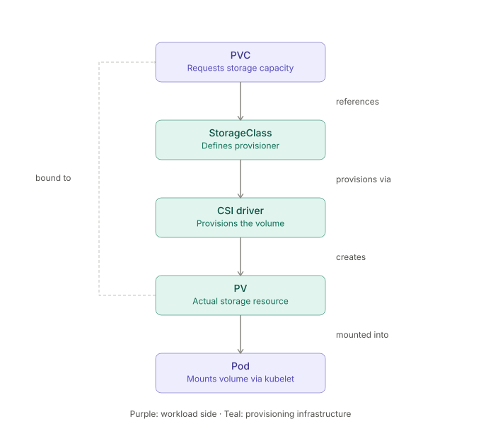

# Networked File Storage
NFS (Network File System) is a **protocol** - that lets a client mount a directory tree living on a remote server and interact with it as if it were a local filesystem. 

The defining idea is transparency: once mounted, open(), read(), write(), stat() etc. on the client get translated into RPC calls to the server instead of hitting local disk, and applications generally don't know the difference.


## Mounting and Un-Mounting
The kernel maintains a VFS (Virtual Filesystem) layer — an abstraction that lets ext4, xfs, nfs, tmpfs, etc. all expose the same syscall interface (open, read, stat...). Mounting is the act of registering a filesystem instance into that VFS tree at a specific dentry (directory entry). Once mounted, the old contents of that directory become invisible — they're still on disk underneath, just shadowed until you unmount.

```sh
    mount [-t fstype] [-o options] device mountpoint

    eg: mount -t nfs -o vers=4.1,hard,timeo=600 10.0.0.5:/exports /mnt/data

    umount mountpoint 
```

## NFS in K8s



**PV**  
The actual storage resource, either hand-created (nfs: field pointing at server/path, as in my first message) or dynamically provisioned by a CSI driver.

**PVC** 
A namespaced request for storage ("give me 10Gi RWX") that the control plane binds to a matching PV.

**StorageClass**
Tells Kubernetes which provisioner creates PVs on demand when a PVC references it, instead of you pre-creating PVs by hand.


There is an official CSI driver for NFS: github.com/kubernetes-csi/csi-driver-nfs. 
csi-driver-nfs will integrate cluster with NFS server, like Azure Files ect.
