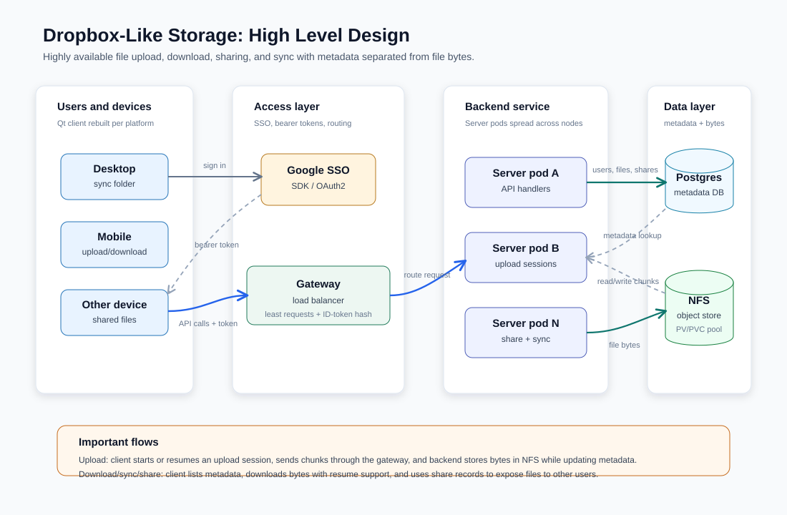
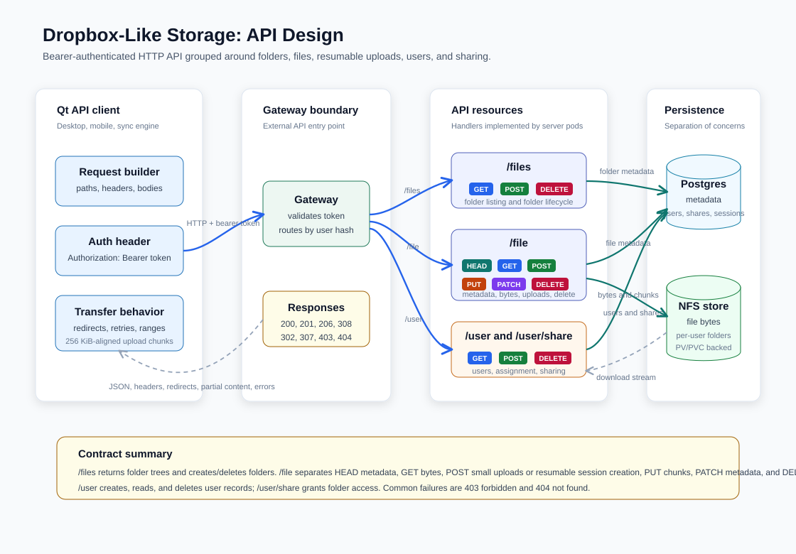

# Dropbox-Like Storage Design

This repository contains AI-generated design notes for a Dropbox-like file storage system. The project focuses on scalable uploads, downloads, sharing, and cross-device sync for files up to 50GB, with availability prioritized over strict consistency.

The design models the system as a scalable object store behind load balancers. Clients authenticate with Google SSO, call backend APIs with bearer tokens, and store file bytes separately from metadata.

## Diagrams

## Documents

- [HLD.md](HLD.md) - high-level requirements, architecture, and API overview.
- [BACKEND.md](BACKEND.md) - backend services, storage, database, and operational design.
- [CLIENT.md](CLIENT.md) - client workflows and API call behavior.
- [DATA.md](DATA.md) - data model notes.
- [NFS.md](NFS.md) - NFS-backed storage notes and Kubernetes volume flow.
- [SCALE.md](SCALE.md) - scaling calculations and autoscaling design.
- [openapi/openapi.yaml](openapi/openapi.yaml) - OpenAPI description of the service API.

## Prototype Notes

The repository is intentionally documentation-first. Only Markdown design files, API specs, and supporting demo scripts are checked in. See [scripts/demo-nfs-wsl.md](scripts/demo-nfs-wsl.md) for the local NFS demo flow.
