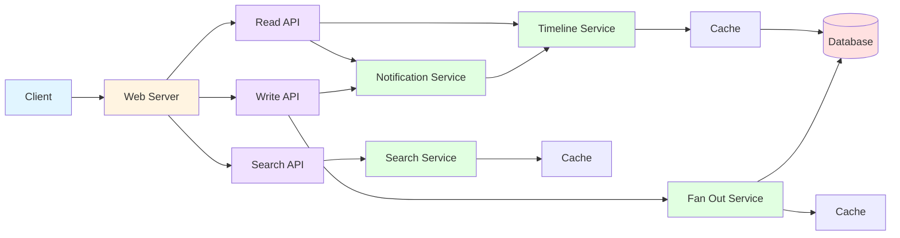
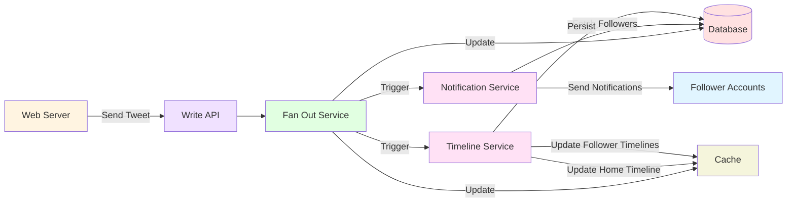

# High Level Design

## Use cases 
* USER can post a TWEET, and that should be visible to all it's followers on their TIMELINES.
* USER can view own TIMELINE, and 'HOME TIMELINE', ie timeline of tweets from all accounts user follows.
* USER can search for TWEETs using keywords.

## Constraints and Assumptions
**General**
* Traffic is not evenly distributed.
* Posting a tweet should be fast - fan out of tweets must be fast, even if user has millions of followers.

**Timeline**
* Viewing timeline must be fast.
*  Twitter is read heavy, optimize for reads.

  **Search**
  * Must be fast
  * Again, read optimize.

## Components
* **Client** 
    Usually web browser

* **Backend** Web server.
    Backend has three distinct swagger apis defined -> **Read**, **Write** and **Search**

**Services** - logical units which have responsibility for certain work flows.
**Timeline Service** : Responsible for sending Timeline to UI, for both user's home and other accounts.
**Fan Out Service**  : Main user of the write api, responsible for writting new tweets to cache/DB, in such a way that they fan out fast.
**Search Service** : Responsible for responding to search queries using search api
**Notification Service** : Sends out notifications of popular posts by accounts followed by user.

* **Cache**
    An in-memory cache to support fast read and fan out requirements.

* **Database** 
    The actual DB storing data long term.

## Core Work Flows

* **User Posts a Tweet**
Web-Server uses write api to send tweet to fan out service, which will update Database and Cache. 

Notification Service should fetch which other users are interested in this ('which accounts follow this user') and send notification to all of them.

Timeline Service should update home timeline and timelines of all accounts following this user.

* **User views home Timeline**
Request lands on timeline service via read api, and it's a simple fetch of user's own posts (top 20 or so), with pagination repeating the request.

* **User views another account's timeline**
Same as home timeline, only for other account.

* **User searches keywords**
Request lands on Search Service, using the search api. Search service queries the DB, which has full text search capability.
