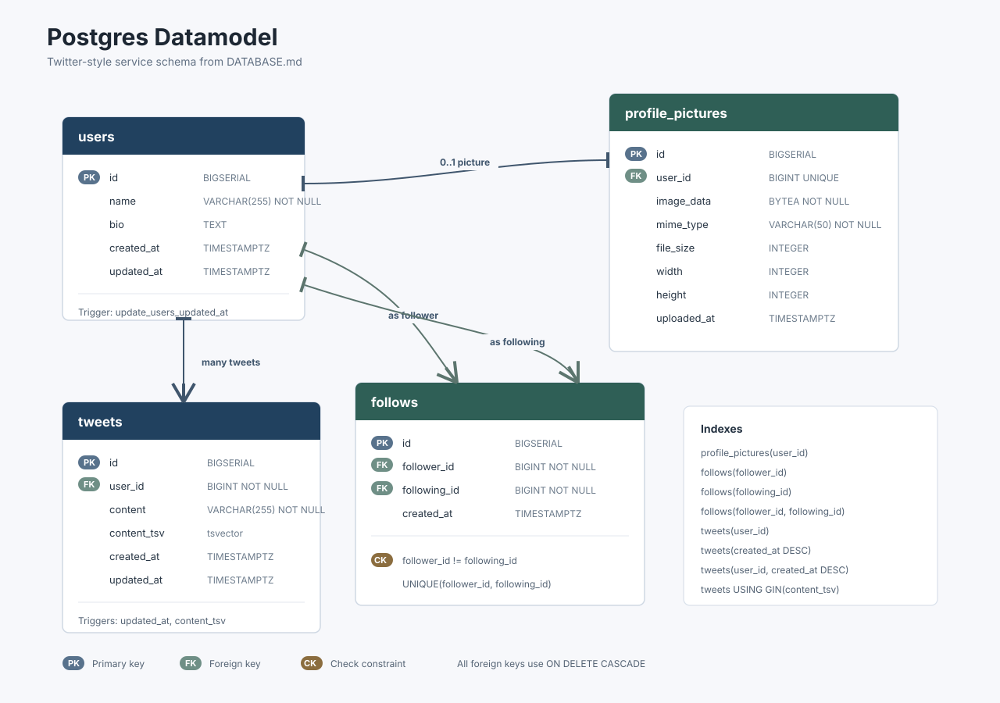
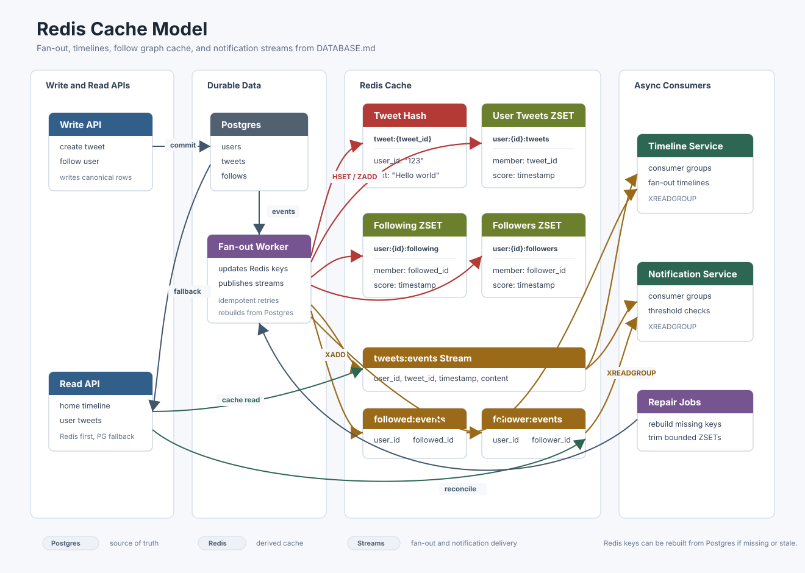

# Twitter Clone Specification

This project is a comprehensive product and systems specification for generating a Twitter-like social platform. It documents the end-to-end design for the application, including high-level architecture, backend services, data models, API contracts, authentication, frontend workflows, Kubernetes deployment, observability, scaling assumptions, and test strategy.

The repository also includes an MCP server that can expose this specification to an LLM so it can generate or reason about an implementation that follows the documented architecture.

## What Is Covered

- High-level product use cases, constraints, and core workflows.
- Backend components for reads, writes, search, timelines, fan-out, notifications, and cache syncing.
- PostgreSQL, cache, search, and transactional outbox data models.
- OpenAPI contracts for read, write, search, and session APIs.
- Authentication, authorization, frontend API workflows, Kubernetes manifests, observability, scaling, and testing guidance.

## Diagrams

### PostgreSQL Data Model

### Cache Model

### Transactional Outbox Pattern

